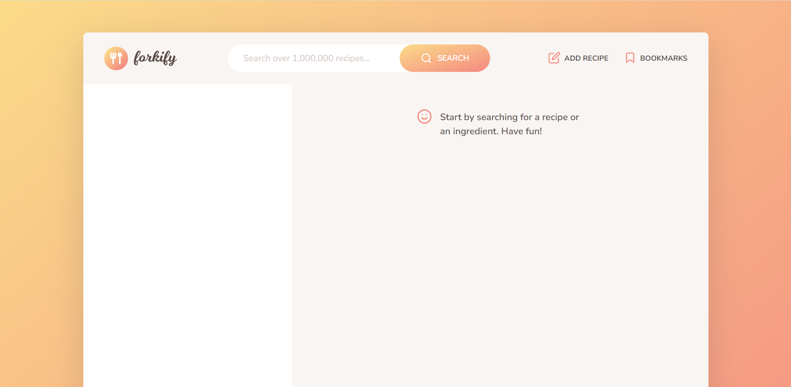
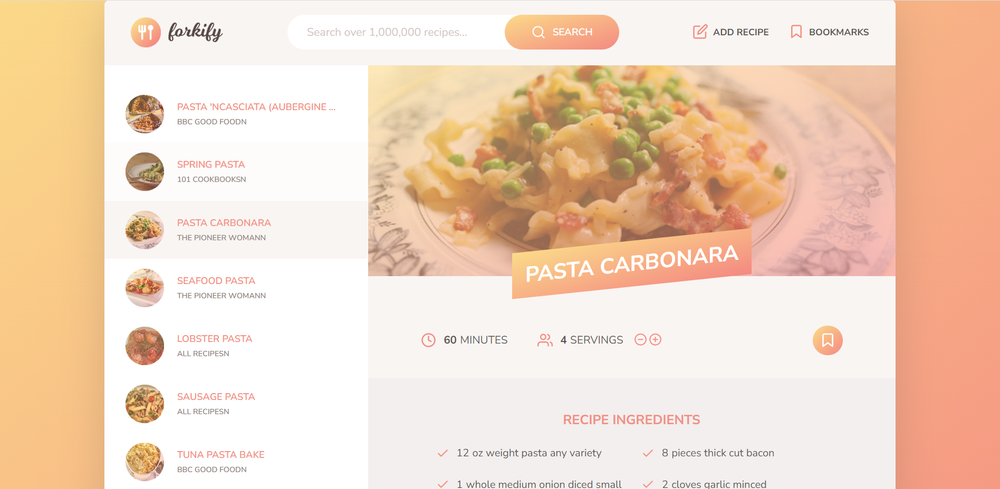

# 🫕🍽️Forkify Website Project

App is about searching recipes with a keyword on search bar, and displaying those recipes including that keyword in the user interface.
Recipes include cooking time, servings, ingredients, and link that the recipe comes from.
Recipe can be indicated as servings modification(increased/decreased) as desired.
Recipes that are liked can be bookmarked.
Additional recipes can be added to app with add recipe button.

# Built with

Project is built with, JavaScript, HTML, SASS.
forkify API is used which is developed by Jonas Schmedtmann.
fractional is used as external library
parcelv2 is used to convert as bundler
regenerator-runtime is used for runtime support
core-js is used for polyfills

# Reach Forkify Website

You can reach the project here, [forkify](https://forkifyberen.netlify.app/)

# Visual of the project

# Acknowledgments

Project is built during the course in Udemy.
The Complete JavaScript Course 2023: From Zero to Expert! by Jonas Schmedtmann.
